[![IBM Cloud powered][img-ibmcloud-powered]][url-ibmcloud]

# Watson Assistant
  

# Pre-requisitos
* Tener instalado [**Node.js**](https://nodejs.org/es/). 
* Tener una cuenta de [**IBM Cloud**](https://cloud.ibm.com/login). 
* Tener una cuenta en [**Github**](https://github.com). 
* **Clonar este Repositorio**.  

## Cupones para profesores y estudiantes:

* Acceder al portal de [IBM Academic Initiative][url-academic] y seleccionar la opción "Register now" si aun no tienes cuenta.
* Realizar el registro correspondiente utilizando la cuenta de correo académica y confirma tu cuenta.
* Despues de confirmar tu cuenta, y con la sesion iniciada en IBM Academic Initiative, en la parte de "Most Popular Topics covered", encontraremos **IBM Cloud** y damos clic en "Learn more".
* Bajamos de la pagina hasta encontrar "Software". Le damos clic, nos dara un apartado que se llama "Request Feature Code".
* Nos dara nuestro codigo. Lo copiamos y lo llevamos a **IBM Cloud**.

## Cargar créditos en IBM Cloud:

* En la parte superior derecha, buscaremos la parte de "MANAGE"/"GESTIONAR", nos desplegara una lista y seleccionaremos "Account"/"Cuenta".
* De lado izquierdo, tendremos una opción "Account settings"/"Configuracion de cuenta".
* Bajamos un poco hasta encontrar "Subscription and feature codes"/"Codigos de suscripción y carateristicas".
* Da clic en "Apply code"/"Aplicar codigo".
* Ingresamos el codigo y clic en "Apply"/"Aplicar".

[url-academic]: https://my15.digitalexperience.ibm.com/b73a5759-c6a6-4033-ab6b-d9d4f9a6d65b/dxsites/151914d1-03d2-48fe-97d9-d21166848e65/home/
[url-onthehub]: https://onthehub.com/ibm/?utm_sourc=ibm-ai-productpage&utm_medium=onthehubproductpage&utm_campaign=IBM
[url-IBMCLOUD]: https://cloud.ibm.com/registration
[url-CLI-IBMCLOUD]: https://cloud.ibm.com/docs/cli/reference/ibmcloud?topic=cloud-cli-install-ibmcloud-cli
[url-github-join]: https://github.com/join
[url-github-cli]: https://git-scm.com/book/en/v2/Getting-Started-Installing-Git
[url-githubdesktop]: https://desktop.github.com/
[url-node]: https://nodejs.org/es/download/

## Contenido
* [Creación de Watson Assistant](#Creación-de-Watson-Assistant).
* [Creación del Skill](#Creación-de-la-Skill).
* [Creación de “Entities"](#Creación-de-"Entities").
* [Creación de “Intents"](#Creación-de-“Intents").
* [Creación del flujo de Diálogo](#Creación-del-flujo-de-Diálogo).
* [Prueba del Asistente desde IBM Cloud](#Prueba-del-Asistente-desde-IBM-Cloud).
* [Despliegue en la nube](#Despliegue-en-la-nube).

# Creación de Watson Assistant.

1. Regresamos a la ventana principal de IBM Cloud y en la barra de búsqueda buscamos el servicio de “Watson Assistant” y damos clic en el icono del servicio. 
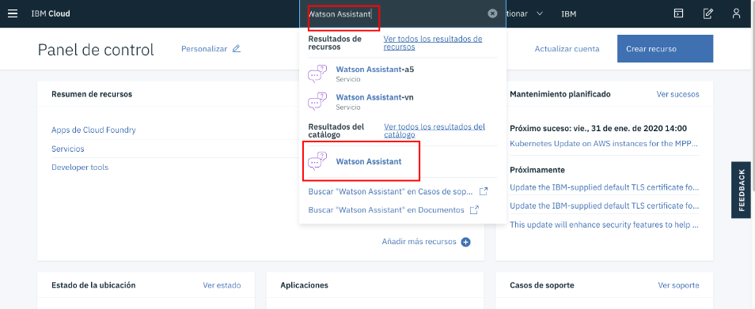 
2. Seleccionamos el plan lite y damos clic en “Crear”. 
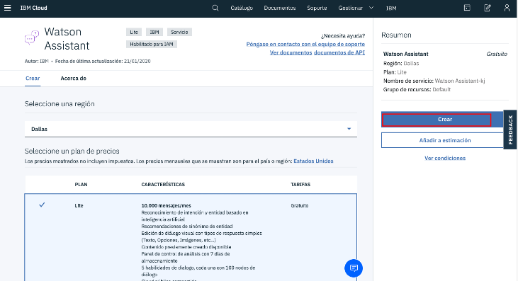 
3. En la siguiente ventana damos clic en “Iniciar Watson Assistant”. 
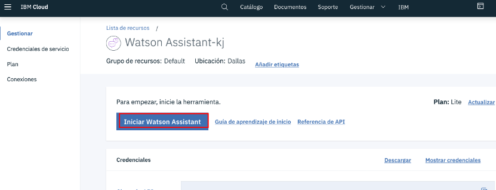 
4. Ahora en la nueva ventana damos clic en el ícono de lado izquierdo y luego en “Create assistant.” 
 
5. Le asignamos el nombre que queramos y damos clic en “créate assistant”. 
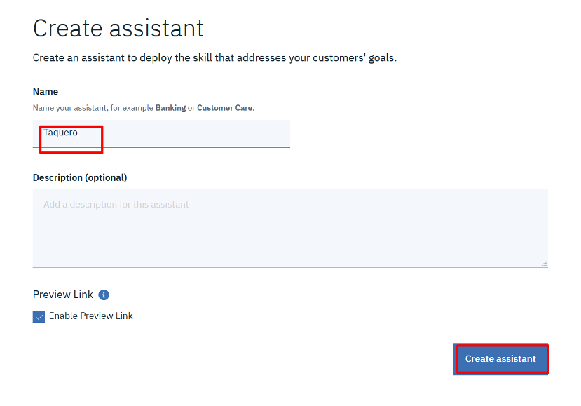 

# Creación de la Skill.

1. En la siguiente ventana damos clic en “Add dialog skill”. 
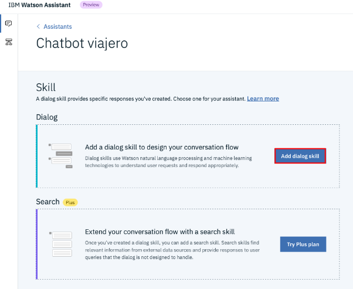 
2. En la siguiente ventana nos vamos a la pestaña de “Create skill”, asignamos un nombre, seleccionamos el idioma en el que entrenaremos a nuestro modelo (“Spanish”) y damos clic en “Create dialog skill”. 
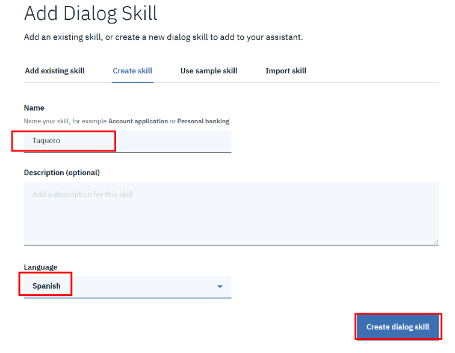 
3. Damos clic en nuestro dialog skill para poder entrenarlo. 
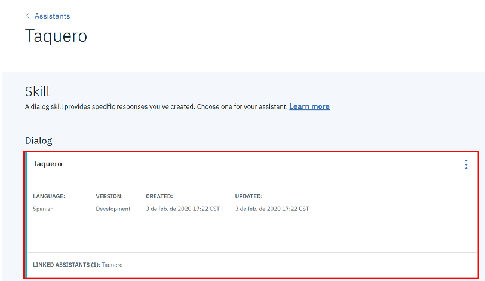 

# Creación de "Entities".

**Si vemos que nos aparece la pestaña de "actions", es el preview, pero es preferible tener la pestaña con intents para continuar el manual por lo que	seguimos las siguientes instrucciones para ver el menú clásico de Watson Assistant.** 
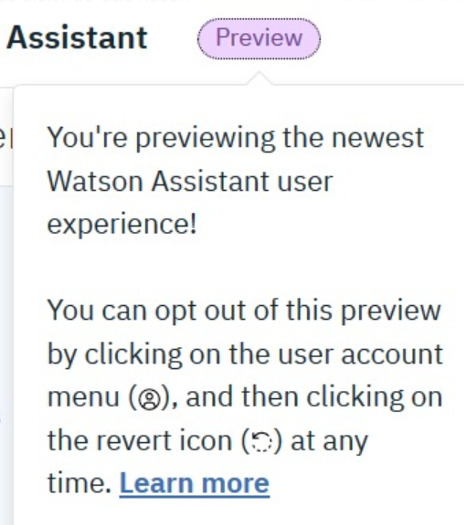 
**En la parte superior derecha, veremos el logo de user, donde encontraremos los detalles de la cuenta iniciada. Encontraremos el nombre de nuestra instancia creada con una pequeña. Le damos clic para revertir a la versión estandar y continuar.** 
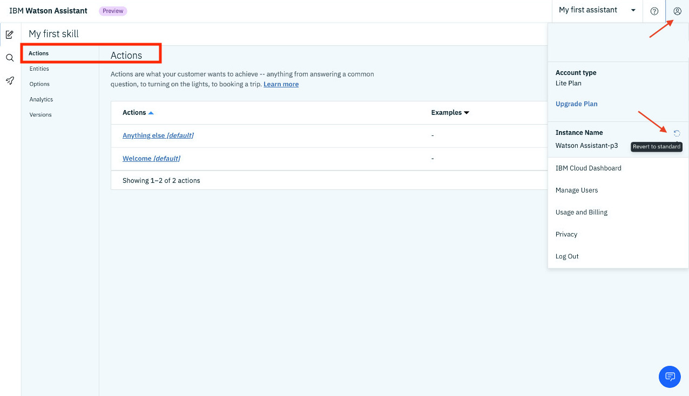 
1. Damos clic en la pestaña de “Entities”. Después clic en "Create entity". 
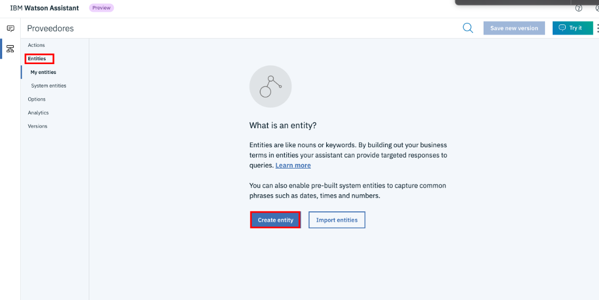 
2. Creamos una variable llamada “taco” la cual va a contener todos los tipos de tacos que tendremos disponibles. 
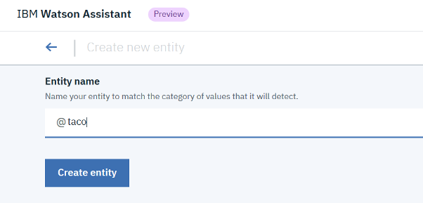 
3. Nombramos el tipo de taco de pastor y agregamos los sinónimos que sean necesarios para que nuestro asistente lo pueda reconocer aun con diferentes nombres. 
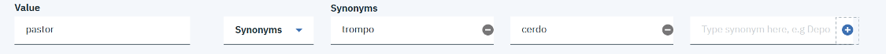 
4. Agregamos los demás tipos de tacos, junto con sus sinónimos. 
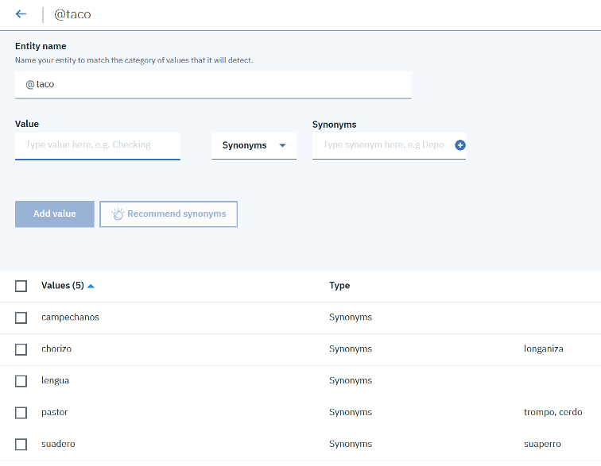 
5. Vamos a la pestaña de "System entities" y activamos "@sys-number". 
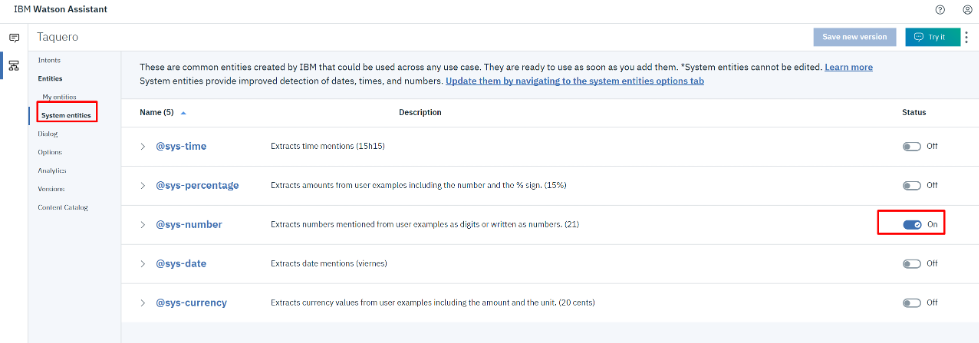 

# Creación de “Intents".

1. Vamos a la pestaña de “Intents” y damos clic en “Create Intent”. 
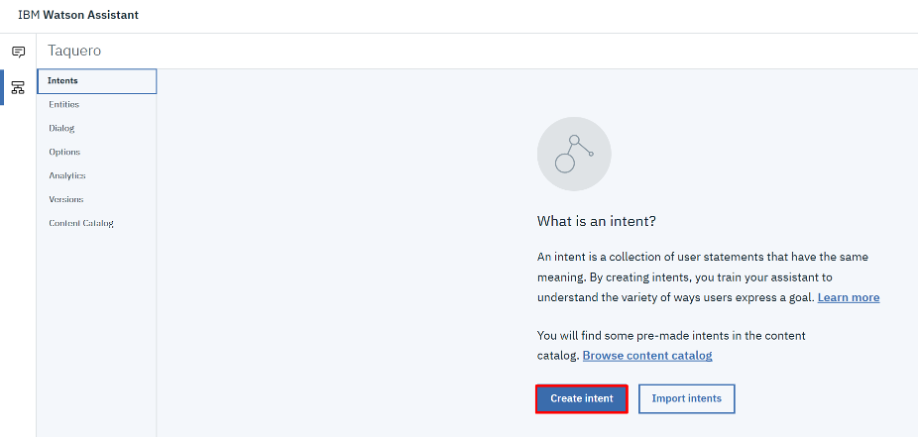 
2. Asignamos el nombre de “saludo” y damos clic en “create intent”. 
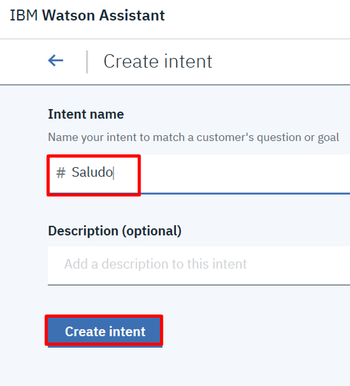 
3. Agregamos al menos 5 formas en las que podríamos saludar al taquero y damos clic en la flecha para regresar a nuestros "intents". 
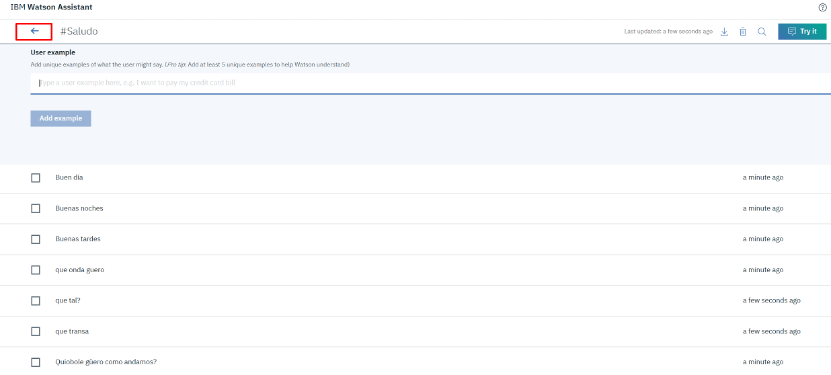 
4. Creamos un nuevo intent con el nombre de “menu”, y clic en "create intent". 
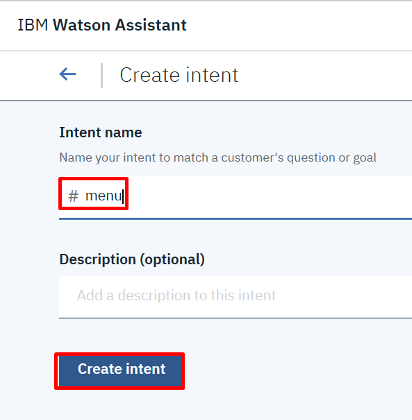 
5. Agregamos al menos 5 formas en las que se le podría pedir el menú al taquero. 
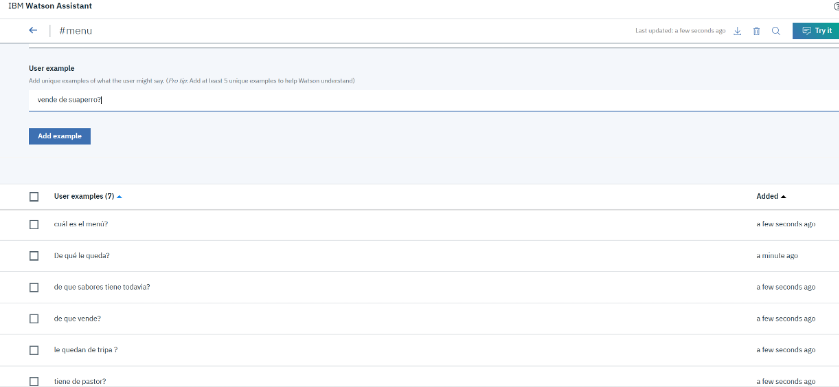 
6. Creamos un nuevo intent llamado “orden”. 
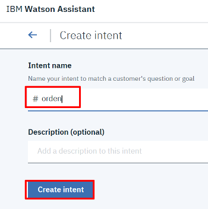 
7. Agregamos al menos 5 formas en las que se le podría ordenar al taquero. 
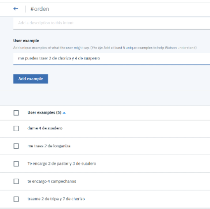 
8. Creamos un nuevo intent llamado “cobrar”. 
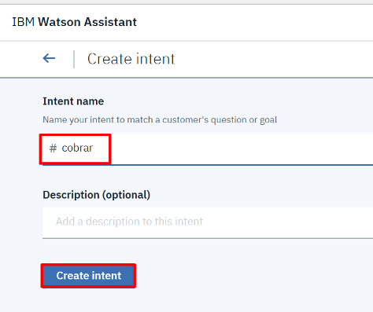 
9. Agregamos al menos 5 formas en las que se le podría pedir la cuenta al taquero. 
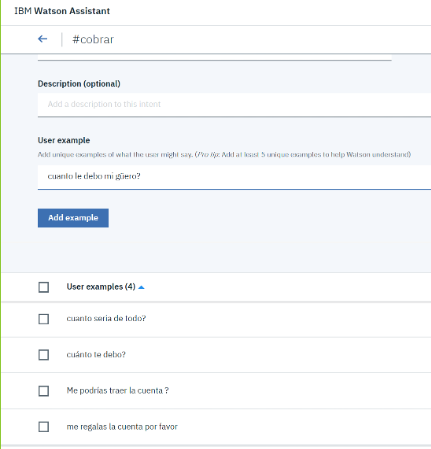 

# Creación del flujo de Diálogo.

1. Damos clic en la pestaña de “Dialog”. 
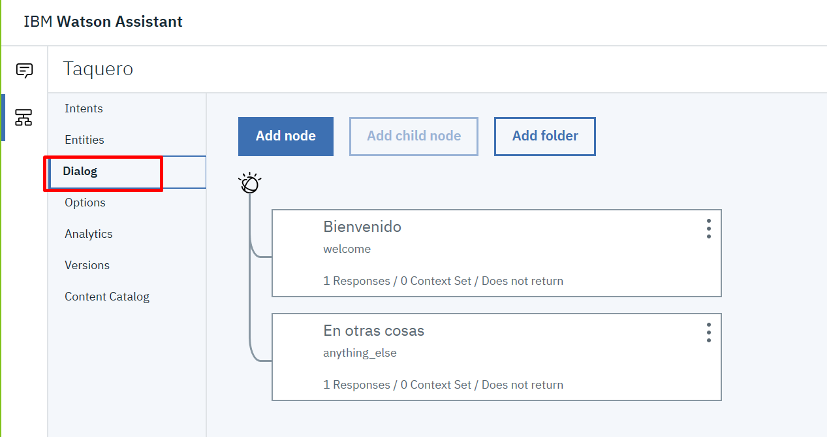 
2. En “Assistant responds” ingresamos el texto de “Soy tu taquero virtual”. 
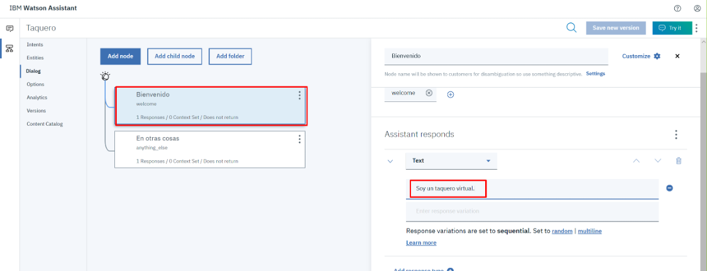 
3. Posteriormente damos clic en “Add node”, asignamos el nombre para poder identificar nuestro nodo y siguiendo la lógica del recuadro que se muestra, Si el asistente reconoce el intent “Saludo”, entonces el asistente responde con algún saludo y preguntando al usuario de que serán sus tacos. 
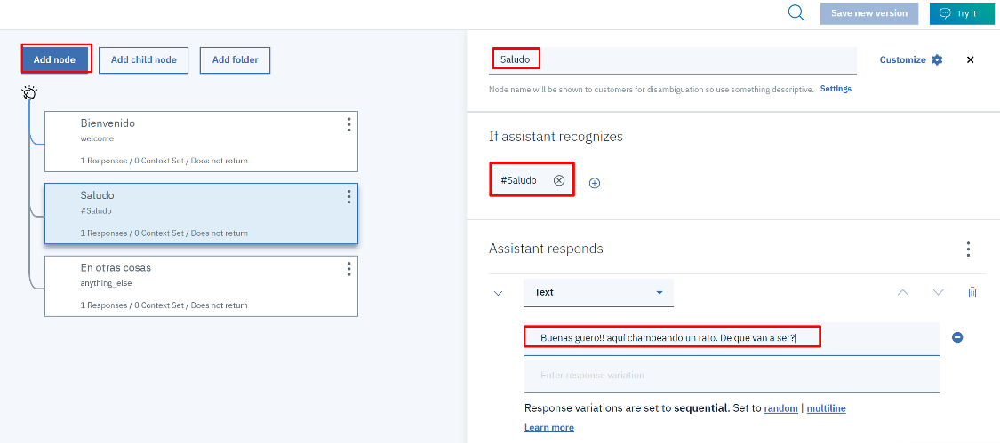 
4. Agregamos un nuevo nodo como el paso anterior y lo nombramos “menu”, posteriormente damos clic en el engrane de “Customize” y en la parte de de abajo de la ventana, activamos el slot de  “Multiple conditioned responses”. 
 
5. Para hacer más interactivo el asistente con el usuario se otorga la capacidad de responder de distintas maneras al usuario y no solo ofrecerle una respuesta estandarizada, es por eso que si el usuario pregunta por algún taco en especial se le da una respuesta personalizada. 
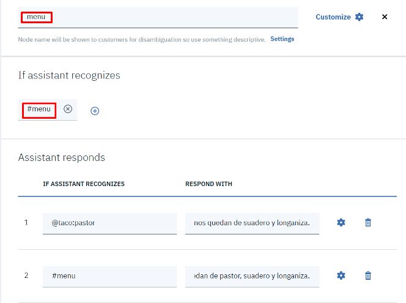 
6. Añadimos un nuevo nodo llamado “ordenar” y en el engrane de “Customize” activamos los slots con el fin de que el usuario ingrese específicamente el numero y sabor del taco que ordenará.Despues en la parte inferior de la ventana activamos “Multiple responses” y amos clic en “Apply”. 
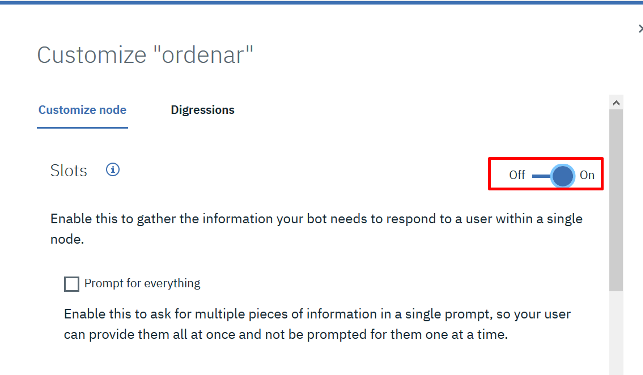 
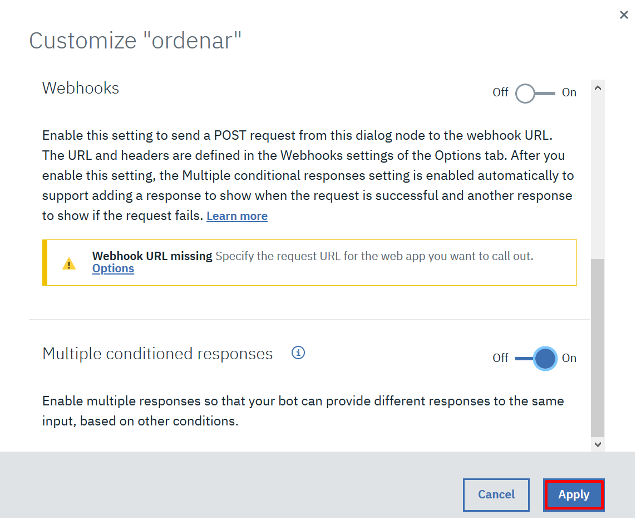 
7. Agregamos un "node" más como en los pasosn anteriores, a este le llamaremos "ordenar". 
8. Para el intent “ordenar” necesitamos información más especifica del usuario como el número y el tipo de taco que ordenará, por lo cual, en la sección de “Then check for” programamos los slots para que le pida al usuario esos rubros forzosamente. 
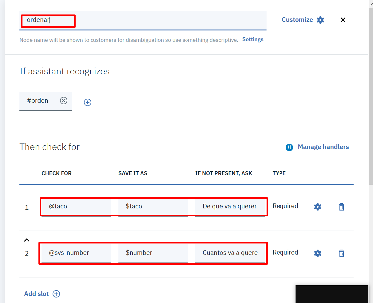 
9. En la sección de “Assitant responds” agregamos distintos tipos de respuesta, pueden ser de texto o con una imagen. 
10. A continuación, se muestra como configurar que si la orden es superior a 10 tacos, se le otorgara una promoción al usuario. 
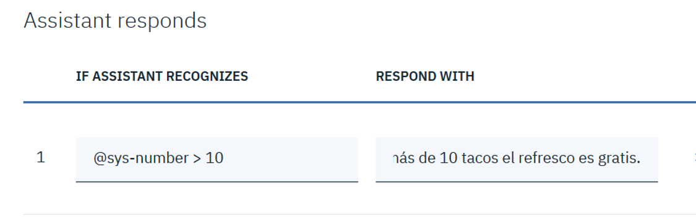 
11. En la segunda respuesta configuramos que se responda con una imagen, para eso damos clic en el engrane. 
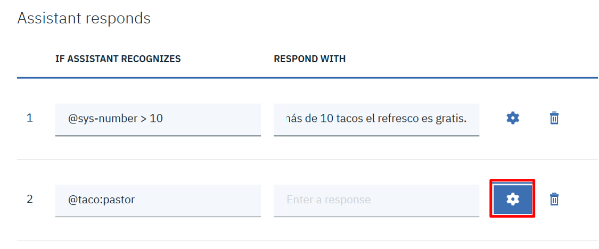 
12. En la siguiente ventana, damos clic en la lista desplegable y seleccionamos “image”. 
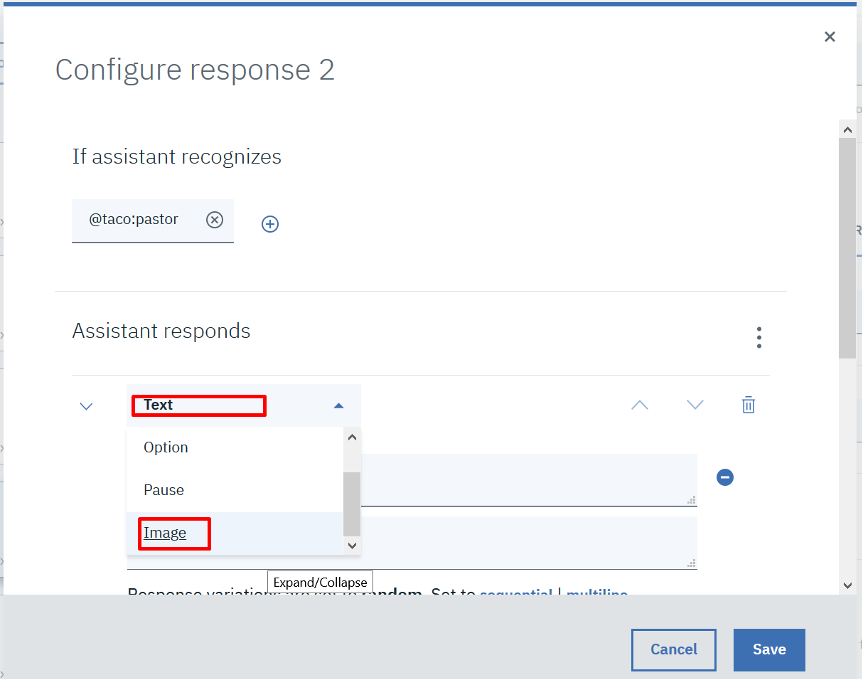 
13. Asignamos una descripción de la imagen, buscamos en el navegador una imagen de tacos de pastor, copiamos la URL de la imagen, la pegamos en el espacio correspondiente y damos clic en “Save”. 
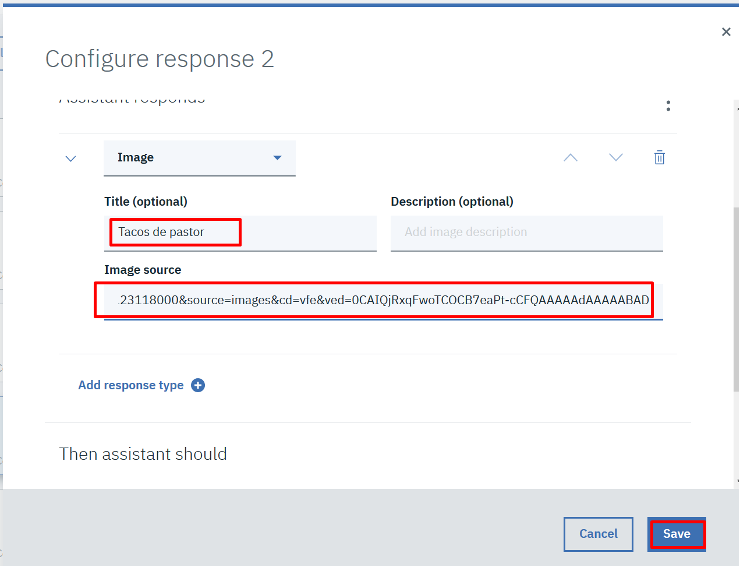 
14. Creamos un nuevo nodo llamado “cuenta” y en el engrane de “Customized” activamos los “Slots” y damos clic en “Apply”. 
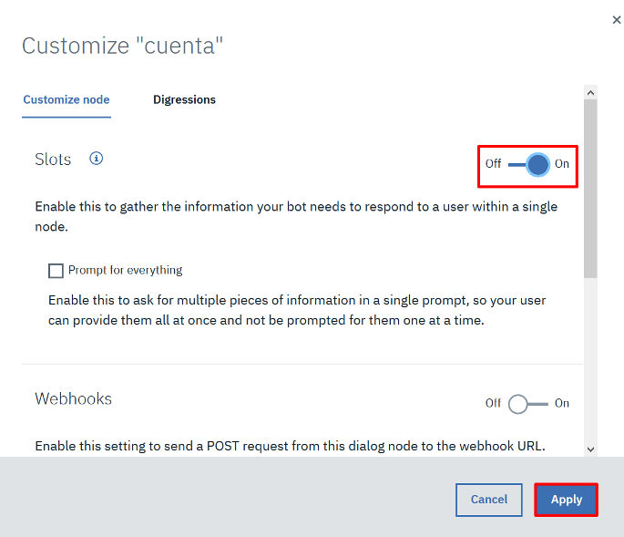 
15. Para el intent “cobrar” tambien necesitamos información más específica del usuario como total de tacos que ordenó por lo cual, en la sección de “Then check for” programamos los slots para que se pida al usuario “Cuantos tacos fueron en total?” y le asignamos una variable “$number”. 
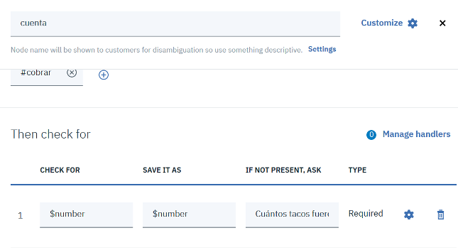 
16. En la sección de “Assistant responds” configuramos la respuesta que se le dará al usuario, para esto seguimos la sintaxis que se muestra a continuación para realizar la operación matemática, tomando en cuenta que el costo por taco es de 8 pesos. 
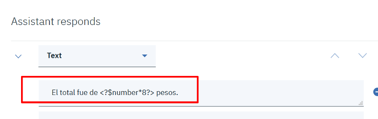 

# Prueba del Asistente desde IBM Cloud

* Probamos nuestro asistente dando clic en “Try it” en la parte superior derecha. 
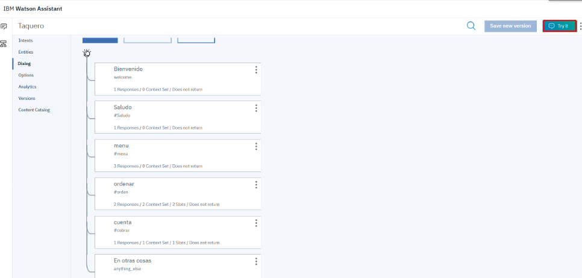 
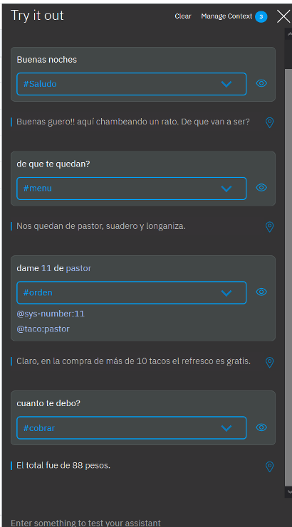 

# Despliegue en la nube.
1. Abrir  la carpeta que clonamos del Github en un editor de textos y vamos al archivo de “app.js” 
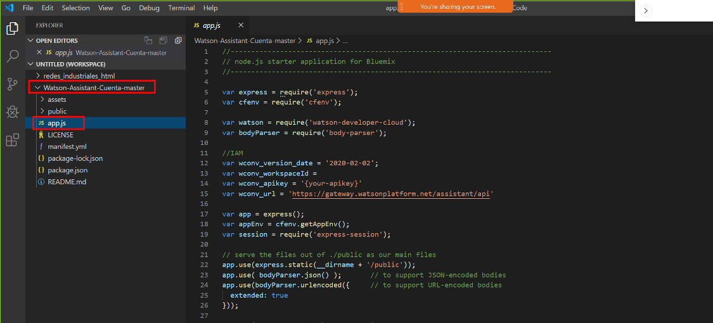 
2. Posteriormente vamos a la lista de recursos de nuestra cuenta de IBM Cloud. 
 
3. En la pestaña de servicios, damos clic en nuestra instancia de “Watson Assistant”. 
 
4. Damos clic en “Iniciar Watson Assistant”. 
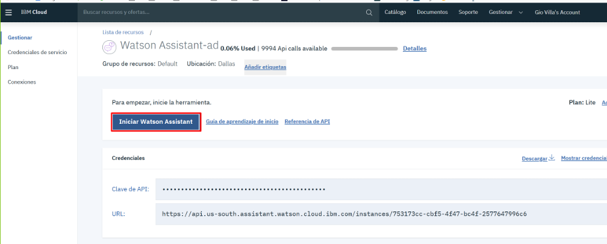 
5. Seleccionamos el "Skill" que acabamos de crear. 
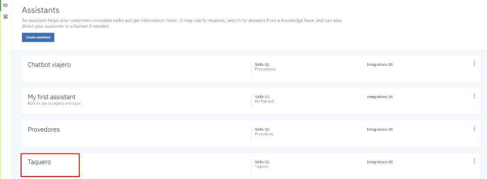 
6. Damos clic en los tres puntos. 
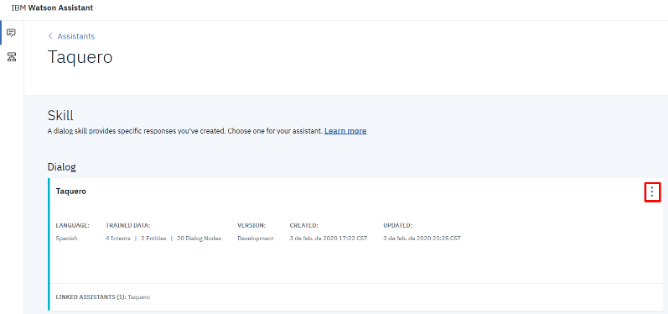 
7. Damos clic en "View API Details". 
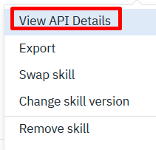 
8. Copiamos el valor de "Skill ID". 
 
9. Regresamos a nuestro archivo “app.js” y pegamos el valor de  nuestra “Skill ID” en la línea 13 en donde nos pide un valor de "wconv_workspaceId=" y salvamos el documento. 
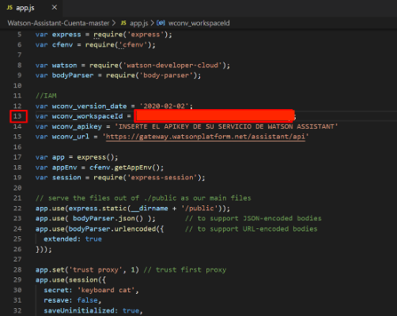 
10. Posteriormente vamos a la lista de recursos de nuestra cuenta de IBM Cloud. 
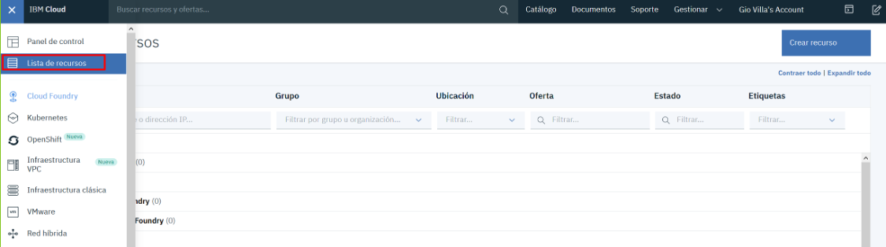 
11. En la pestaña de servicios, damos clic en nuestra instancia de “Watson Assistant”. 
 
12. Damos clic en la pestaña de “credenciales de servicio”, después en “Ver credenciales” y copiamos el “apikey”. 
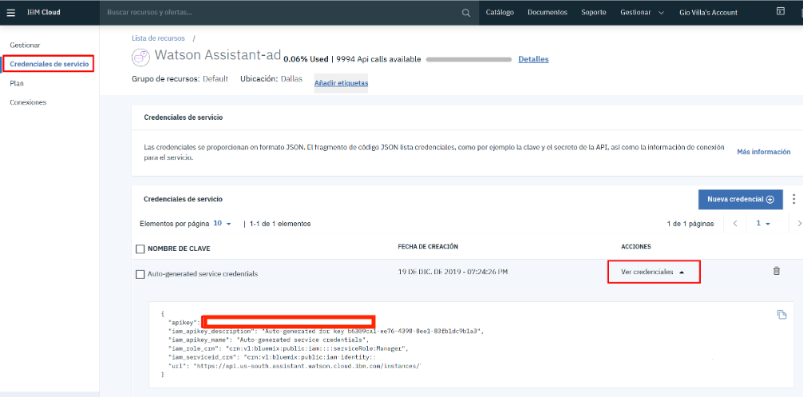 
13. Regresamos a nuestro archivo “app.js” en nuestro editor de texto y pegamos el “apikey” en la línea 14 en donde nos pide "wconv_apikey = " y salvamos el archivo. 
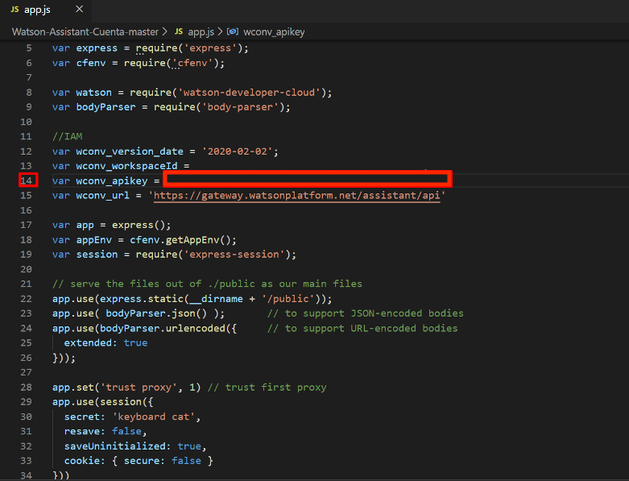 
14. Dentro de nuestro editor de texto vamos al archivo “manifest.yml” y asignamos un nombre único a nuestra aplicación, en donde nos pide "name: ". 
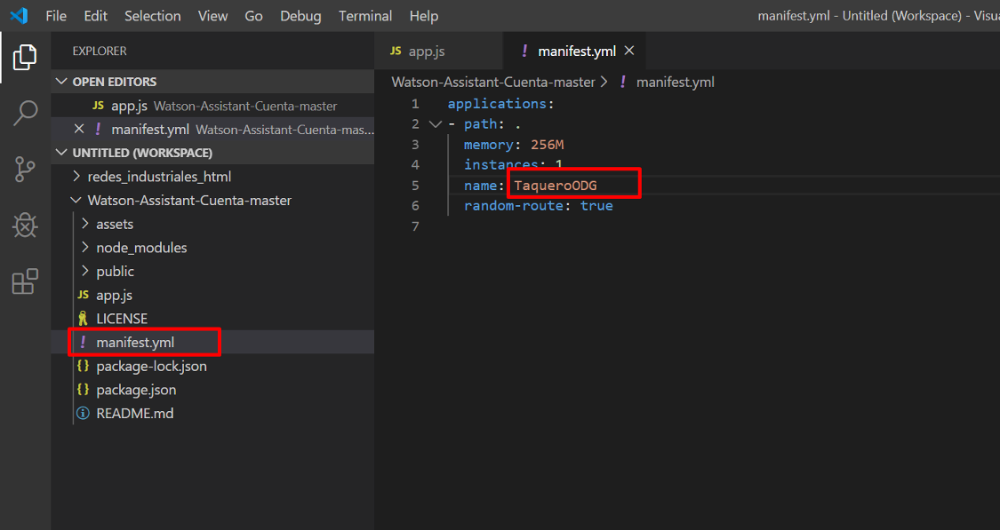 
15. Posteriormente abrimos una nueva terminal y nos direccionamos en la carpeta que clonamos del repositorio. 
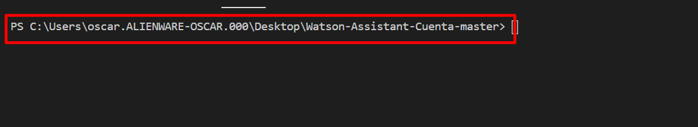 
16. Ingresamos el comando “ibmcloud login –sso”. 
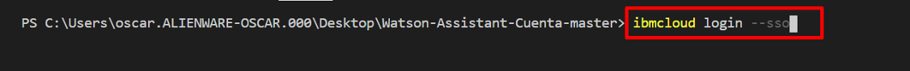 
17. Insertamos “Y” para que se nos genere un código de autentificación una vez iniciada la sesión con nuestra cuenta de IBM Cloud desde nuestro navegador. 
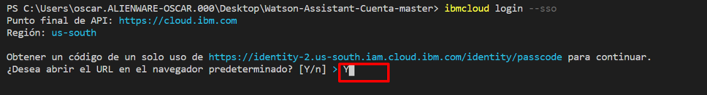 
18. Copiamos el código que se nos abrirá en nuestro navegador. 
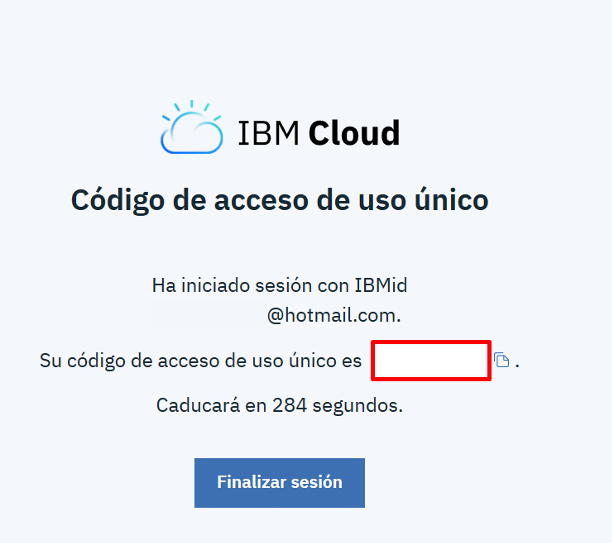 
19. Lo pegamos en la terminal y damos enter (no se verá nada por seguridad). Aparecerá “Correcto” si se ingresó correctamente. 
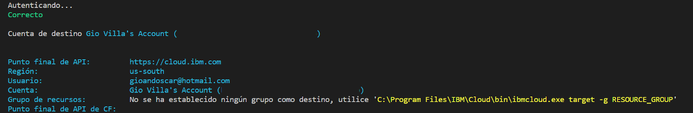 
20. Corremos el comando “ibmcloud target -cf“ para redirigirnos a nuestra organización y espacio predeterminados. 
 
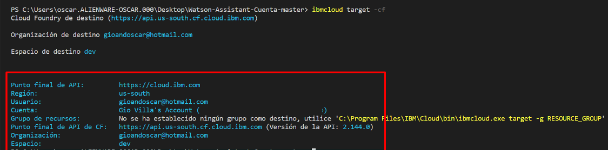 
21. Corremos el comando “ibmcloud cf push” para desplegar nuestra aplicación en la nube. 
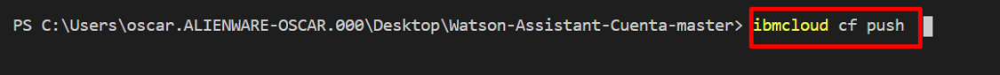 
22. Una vez que termine de cargar todo el proceso necesario de la terminal, nos arrojara un link en el cual podremos accesar a nuestra aplicación a través de internet, copiamos la dirección. 
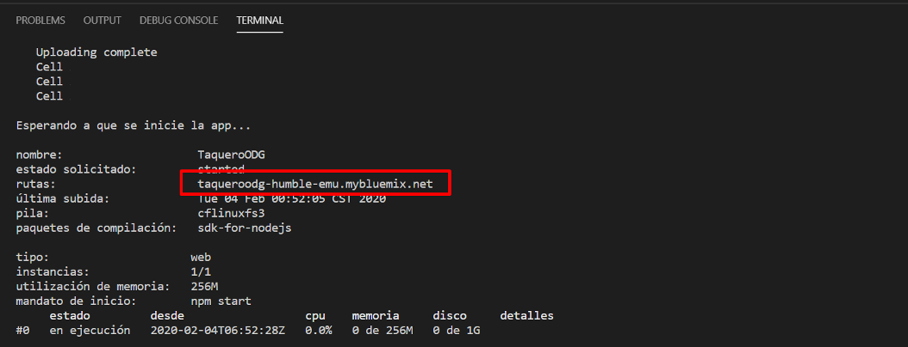 
23. Abrimos un navegador y pegamos el link copiado en el paso anterior. Iniciara la aplicacion, damos clic en “Iniciar”. 
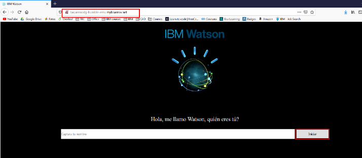 
24. Prueba tu asistente virtual. 
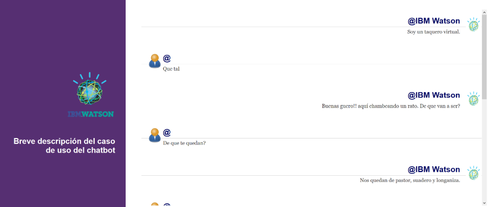 
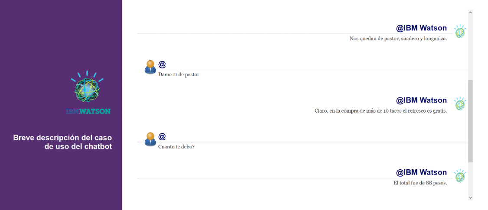 

[img-ibmcloud-powered]: https://img.shields.io/badge/IBM%20Cloud-Powered-blue.svg
[url-ibmcloud]: https://www.ibm.com/cloud/